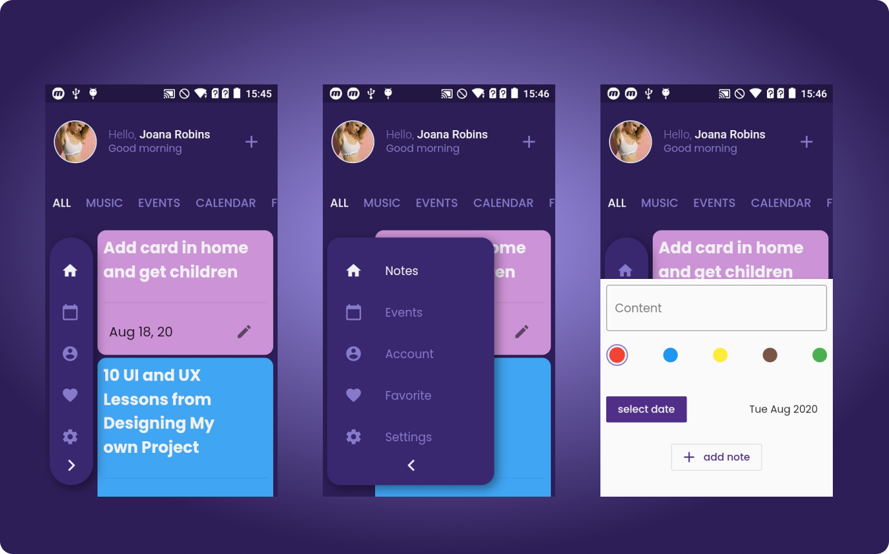

<h1 align="center">
  <br>
  <a href=""></a>
  <br>
  Notes Todo 
  <br>
</h1>

 <h4 align="center">To start using the flutter you can access <a href="https://flutter.dev" target="_blank">Flutter</a>.</h4>
 <h3>Animated notes and reminders app with Flutter.</h3>

 <p float="left">
  
</p>


.

## How to use

To clone and run thi application, you will need [Git](https://git-scm.com) and [Flutter](https://flutter.dev/docs/get-started/install) installed on your computer.


```bash
#Clone this repository
$ git clone https://github.com/gabriel-oliveira800/annotations-app

#Go into the repository
$cd annotations-app

# Install dependencies
$ flutter packages get

# Run the app
$ flutter run

# Build app
$flutter build apk
```
